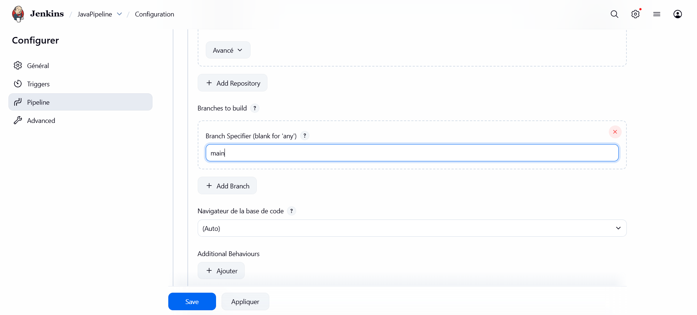
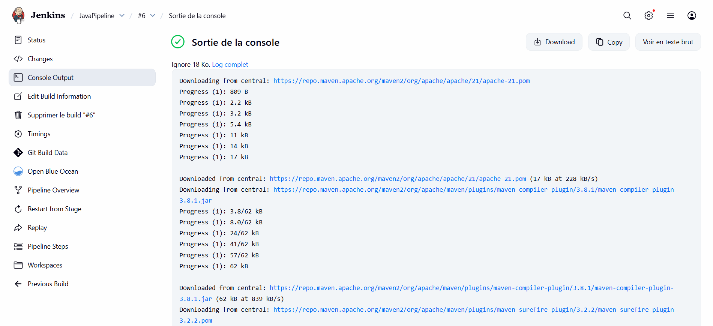
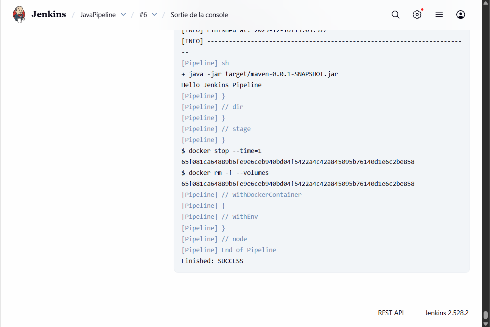

# TPJavaPipeLine-BouhmadiManar

# TP Java Jenkins Pipeline

## Objectif
Créer un pipeline Jenkins avec Docker et Maven.

## Pipeline Jenkins

 
 

## Résultat
Le projet compile et s’exécute correctement.
